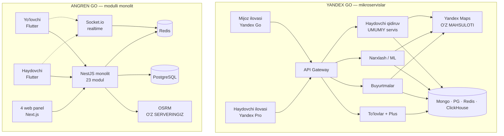

# Angren Go ↔ Yandex Go — arxitektura va funksiya solishtiruvi

> Tuzilgan: 2026-08-19 · Manba: `AngrenTaxi` repozitoriysi (kod bo'yicha o'lchangan) + Yandex ochiq manbalari

---

## 0. Nima solishtirildi va qanday

- **Sizniki** — taxmin emas, **kod bo'yicha sanaldi**: 23 backend moduli, 114 Flutter fayli, 4 ta web panel, barcha controller endpointlari.
- **Yandex** — rasmiy App Store / Google Play ta'riflari, Yandex'ning ochiq muhandislik nashrlari (`userver`), va O'zbekiston bo'yicha yangiliklar.
- Solishtiruv **ikkala tomon uchun**: yo'lovchi va haydovchi.
- Yandex'ning yopiq ichki tafsilotlari (aniq dispatch algoritmi, ML narxlash) ommaga ochiq emas — ular haqida faqat ma'lum bo'lgani yozildi, taxmin qilinmadi.

---

## 1. Qisqacha xulosa — uchta jumlada

1. **Arxitekturangiz to'g'ri shaklda.** Modulli monolit + ajratilgan realtime shlyuz — bu sizning bosqichingiz uchun aynan to'g'ri tanlov. Yandex ham monolitdan boshlagan va faqat masshtab talab qilgandagina bo'lgan.
2. **Farq arxitekturada emas, QAMROVDA.** Yandex 8+ vertikal va 10 mamlakatda ishlaydi; sizda 4 vertikal va 1 shahar.
3. **Eng katta haqiqiy kamchilik — taksi vertikalining CHUQURLIGI**, ayniqsa haydovchi tomonida: talab xaritasi, rejalashtirilgan safar, chaqim va saqlangan kartalar yo'q.

---

## 2. Arxitektura solishtiruvi

### 2.1 Yandex Go — ma'lum bo'lgan arxitektura

Yandex Taxi bo'limi monolitdan mikroservislarga o'tgan va shu jarayonda o'zining **`userver`** freymvorkini yaratgan — C++ asinxron freymvork, 2022-yilda ochiq kodga chiqarilgan.

| Qatlam | Yandex |
|---|---|
| Til / freymvork | C++ (`userver`) + Python |
| Ma'lumotlar bazasi | MongoDB, PostgreSQL, Redis, ClickHouse |
| Protokollar | HTTP, gRPC, AMQP, TCP |
| Xarita / marshrut | O'z mahsuloti — Yandex Maps, Yandex Navigator |
| Test | `testsuite` (Python/pytest, mikroservislarga mo'ljallangan) |
| Deploy | Ko'p ma'lumot markazi, ko'p mamlakat |

**Eng muhim naqsh:** Yandex'da **haydovchi qidiruv mikroservisi bitta** va u ham taksi haydovchisini, ham yetkazish kuryerini topadi. Ya'ni ta'minot (supply) hovuzi vertikallar orasida umumiy.

### 2.2 Angren Go — hozirgi arxitektura

| Qatlam | Sizniki |
|---|---|
| Backend | NestJS modulli monolit, **23 modul** |
| Ma'lumotlar bazasi | PostgreSQL (TypeORM) + Redis (geo-indeks, navbat) |
| Realtime | Socket.io shlyuzi (`realtime` moduli) |
| Marshrut | **O'z OSRM serveringiz** + MapLibre + MapTiler |
| Mobil | Flutter, 2 flavor (`passenger` / `driver`) |
| Web | Next.js × 4: `admin`, `manager`, `market`, `restaurant` |
| To'lov | Payme · Click · Uzcard (hosted sahifa) |
| Deploy | Railway, bitta region |

**Backend modullari (23):**
`auth` · `users` · `drivers` · `orders` · `matching` · `tariffs` · `surge` · `routing` · `realtime` · `payments` · `promo-codes` · `referrals` · `driver-bonuses` · `ratings` · `safety` · `support` · `trip-chat` · `notifications` · `favorites` · `settings` · `tariff-change-requests` · `food` · `market`

### 2.3 Tizim xaritasi — yonma-yon

### 2.4 Hukм — arxitektura bo'yicha

| Jihat | Baho |
|---|---|
| Modulli monolit tanlovi | ✅ **To'g'ri.** Bu bosqichda mikroservis — ortiqcha murakkablik. |
| Modul chegaralari toza | ✅ 23 modul, har biri o'z domenida |
| Realtime birinchi darajali | ✅ Alohida `realtime` moduli, Redis geo-indeks |
| O'z OSRM'ingiz | ✅ Kuchli tomon — Yandex ham o'z xaritasini ishlatadi, siz esa litsenziya to'lamaysiz |
| Matching sifati | ✅ Redis GEORADIUS → **OSRM ETA bo'yicha qayta tartiblash** (havo masofasi emas) |
| Ko'p shahar / ko'p region | ❌ Bitta shahar qat'iy kodlangan |
| Vertikallar bo'yicha umumiy ta'minot | ⚠️ Qisman — pastda 5-bo'limga qarang |

**Birinchi bo'lib ajratiladigan modul:** `matching`. U eng issiq, eng holatli (Redis navbatlar, timeout'lar) va Yandex ham aynan shu servisni birinchi bo'lib umumiylashtirgan.

---

## 3. YO'LOVCHI tomoni

### 3.1 Sizda allaqachon bor

Taksi buyurtma · oraliq to'xtashlar · sevimli manzillar · tarif tanlash · surge narxlash · promo kod · referal · hamyon (Payme/Click/Uzcard + yechib olish) · safar chati · SOS · haydovchini baholash · buyurtmalar tarixi · bildirishnomalar · qo'llab-quvvatlash chati · **cargo** · **ovqat** · **market**

Bu ro'yxat kutilganidan uzun — asosiy taksi oqimi to'liq.

### 3.2 Yandexda bor, sizda YO'Q

| # | Funksiya | Izoh | Og'irlik |
|---|---|---|---|
| 1 | **Rejalashtirilgan safar** | Oldindan vaqt belgilab buyurtma | 🔴 Yuqori |
| 2 | **Chaqim (tips)** | Yandex O'zbekistonda kartadan chaqim beriladi | 🔴 Yuqori |
| 3 | **Saqlangan kartalar** | Sizda har safar hosted sahifa ochiladi | 🔴 Yuqori |
| 4 | **Safar cheki** | Buyurtma tarixidan chek yuklab olish | 🟡 O'rta |
| 5 | **Shaharlararo** | Yandex O'zbekistonda 2026-may'da 23 yo'nalish ochgan | 🟡 O'rta |
| 6 | **Safar opsiyalari** | Bola o'rindig'i, hayvon, yuk joyi | 🟡 O'rta |
| 7 | **Yetkazish kuzatuvi** | Kuryerni xaritada real vaqtda ko'rish | 🟡 O'rta |
| 8 | **Shahar tanlash** | Ko'p shaharli ishlash | 🟡 O'rta |
| 9 | **Yo'qolgan buyum** | Lost & found oqimi | 🟢 Past |
| 10 | **Korporativ hisob** | Kompaniya hisobidan safar | 🟢 Past |
| 11 | **Obuna (Plus)** | Yandex Plus — ballar, bepul yetkazish | 🟢 Past |
| 12 | **Birgalikda safar (Carpool)** | Arzonroq, boshqalar bilan | 🟢 Past |
| 13 | **Samokat ijarasi** | Yandex Go Scooters | ⚪ Mos emas |
| 14 | **Jamoat transporti** | Avtobus jadvali | ⚪ Mos emas |
| 15 | **Talab vizualizatsiyasi** | "Yaqinda nechta odam ketmoqchi" (2025) | ⚪ Mos emas |

### 3.3 Yandexda bor, sizda YO'Q — SAHIFALAR

1. **Rejalashtirilgan safar** — sana/vaqt tanlash + rejalar ro'yxati
2. **To'lov usullari** — kartalar ro'yxati, qo'shish/o'chirish (hozir bunday sahifa umuman yo'q)
3. **Chaqim** — baholash ekranida foiz tanlash bloki
4. **Safar cheki** — buyurtma tafsilotidan chek
5. **Safar opsiyalari** — buyurtma oldidan qo'shimcha talablar sheet'i
6. **Shaharlararo** — yo'nalish + jo'nash vaqti tanlash
7. **Shahar tanlash** — profil ichida
8. **Kuryer kuzatuvi** — yetkazish uchun jonli xarita
9. **Yo'qolgan buyum** — safar tafsilotidan ariza
10. **Korporativ hisob** — profil ichida

---

## 4. HAYDOVCHI tomoni

### 4.1 Sizda allaqachon bor

Onlayn/oflayn · buyurtma taklifi (15s taymer) · navigatsiya · yetib keldim → safar → yakunlash · daromad ekrani + tafsilot · **bonuslar tizimi** (`driver-bonuses`) · KYC hujjat yuklash · yo'lovchini baholash · balans va komissiya · tarif o'zgartirish so'rovi · safar chati · SOS

### 4.2 Yandex Pro'da bor, sizda YO'Q

| # | Funksiya | Izoh | Og'irlik |
|---|---|---|---|
| 1 | **Talab xaritasi (heatmap)** | Yandex'ning eng ko'p ishlatiladigan haydovchi funksiyasi. **Sizda `surge` backend'da bor, lekin haydovchiga umuman ko'rsatilmaydi** | 🔴 Juda yuqori |
| 2 | **Prioritet tizimi** | Haydovchi reytingi buyurtma navbatiga ta'sir qiladi | 🔴 Yuqori |
| 3 | **Smena rejalashtirish** | Ish vaqtini oldindan belgilash | 🟡 O'rta |
| 4 | **To'lov jadvali** | "Ertaga tushadi" — payout sozlamalari | 🟡 O'rta |
| 5 | **Hujjat yangilash** | Muddati tugaydigan hujjatlarni qayta yuklash (sizda faqat boshlang'ich KYC) | 🟡 O'rta |
| 6 | **Darslar / kurslar** | Yandex haydovchilarni ilova ichida o'qitadi | 🟡 O'rta |
| 7 | **Avtomobil almashtirish** | Bir nechta mashina, birini tanlash | 🟢 Past |
| 8 | **Eshitmaydigan haydovchilar rejimi** | Buyurtmada ekran chaqnaydi + tebranish | 🟢 Past |
| 9 | **Sherik takliflari** | Yoqilg'i, servis chegirmalari | 🟢 Past |

### 4.3 Yandexda bor, sizda YO'Q — SAHIFALAR

1. **Talab xaritasi** — surge zonalari rangli xaritada
2. **Prioritet / sifat** — reyting, qabul foizi, prioritet darajasi
3. **Smena rejasi** — kelasi kunlar uchun ish vaqti
4. **To'lov sozlamalari** — qanday va qachon pul olish
5. **Hujjatlarim** — muddat va yangilash
6. **Darslar** — video/test
7. **Mening avtomobillarim** — ro'yxat va tanlov

---

## 5. Eng muhim arxitektura kamchiligi

`matching` moduli **`service_type` ni umuman hisobga olmaydi.**

Kodda tekshirildi: `matching.service.ts` da `serviceType` bo'yicha filtr yo'q. Ya'ni:

- Cargo buyurtmasi kelganda **istalgan onlayn haydovchiga** taklif boradi — furgon egasiga ham, oddiy yengil avtomobilga ham.
- Ovqat/market buyurtmalari uchun kuryer topish oqimi umuman ulanmagan.

Yandex'ning yechimi aynan shu nuqtada: **bitta qidiruv servisi, lekin talab turiga qarab ta'minot hovuzi filtrlanadi.** Sizda `orders.service_type` va `tariffs.vehicle_type` primitivlari **allaqachon mavjud** — ular shunchaki matching'ga ulanmagan.

Bu — kichik o'zgarish, katta ta'sir. Super-app'ning ishlashi shunga bog'liq.

---

## 6. Yo'l xaritasi

### 1-bosqich — taksi vertikalini chuqurlashtirish *(pul olib keladi)*
- Talab xaritasi haydovchiga (`surge` allaqachon bor — faqat UI kerak)
- Chaqim (tips)
- Saqlangan kartalar
- Safar cheki
- Rejalashtirilgan safar

### 2-bosqich — matching'ni super-app'ga moslash *(arxitektura)*
- `matching` ga `service_type` + `vehicle_type` filtri
- Kuryer roli (`courier`) va ovqat/market buyurtmalarini matching'ga ulash
- Haydovchi prioritet tizimi

### 3-bosqich — kengayish
- Ko'p shahar (`city_id` butun modelga)
- Shaharlararo
- Haydovchi smenasi, hujjat yangilash, darslar

### 4-bosqich — masshtab
- `matching` ni alohida servisga ajratish (birinchi nomzod)
- Ko'p region deploy
- Analitika ombori (ClickHouse — Yandex ham shuni ishlatadi)

---

## 7. Sotib olish vs qurish

| Narsa | Tavsiya | Sabab |
|---|---|---|
| Marshrut / xarita | ✅ Qurgansiz (OSRM) — **saqlang** | Litsenziya to'lamaysiz, Yandex ham o'zinikini ishlatadi |
| To'lov | ✅ Sotib olgansiz (Payme/Click/Uzcard) — to'g'ri | PSP qurish — mahsulotingiz emas |
| Push / SMS | ✅ Firebase — to'g'ri | |
| Dispatch / matching | ✅ Qurish — **bu sizning mahsulotingiz** | Farqlanish shu yerda |
| Analitika | ⏳ Keyinroq ClickHouse | Hozir PostgreSQL yetarli |
| Xarita uslubi | ✅ Qurgansiz (`style_light/dark.json`) | Brend |

---

## Manbalar

- [Yandex Go — Google Play](https://play.google.com/store/apps/details?id=ru.yandex.taxi)
- [Yandex Go — App Store](https://apps.apple.com/us/app/yandex-go-taxi-food-delivery/id472650686)
- [Yandex Pro (Taximeter) — Google Play](https://play.google.com/store/apps/details?id=ru.yandex.taximeter)
- [Yandex Pro — App Store](https://apps.apple.com/uz/app/yandex-pro/id1496904594)
- [Yandex ochiq kodga chiqargan `userver` freymvorki](https://tadviser.com/index.php/Product:Yandex_Userver_(framework))
- [Yandex `testsuite` — mikroservis test freymvorki](https://yandex.github.io/yandex-taxi-testsuite/intro/)
- [Yandex Go super-app e'loni](https://ffnews.com/newsarticle/yandex-unifies-restaurant-and-grocery-delivery-taxi-courier-and-other-services-in-its-new-superapp-yandex-go/)
- [Yandex Go O'zbekiston — karta to'lovlari](https://kun.uz/en/news/2021/03/23/yandex-go-launches-payment-by-bank-cards-in-tashkent)
- [Yandex Go O'zbekiston — shaharlararo va qamrov](https://tourfixer.uz/en/blog/yandex-taxi-uzbekistan-guide-2026)
- [Yandex Go Uzbekistan qo'llanmasi](https://voyage.uz/guides/transport-yandex-go/)
